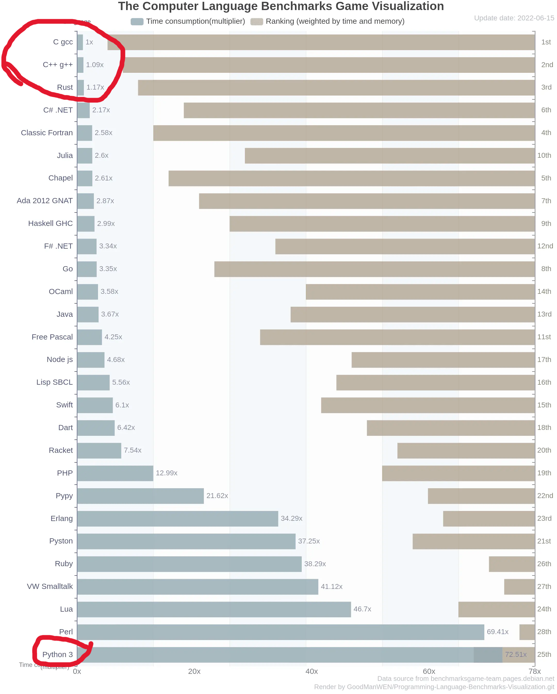
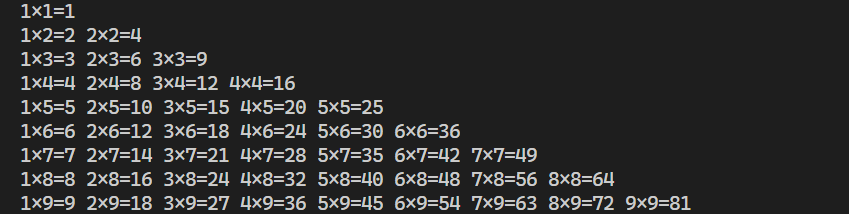

# 1. Python基础语法（day 1）

# 1.1. Python语言介绍

Python 是一种解释型语言，由 Guido van Rossum 于 20 世纪 80 年代末开始设计，并在 1991 年首次公开发布。Python 的设计目标之一，是让程序具有清晰、简洁、易读的特点。

对比使用C语言和Python语言输出“Hello World”：

C语言：

``` C
#include "stdio.h"
int main() {
    printf("Hello World");
    return 0;
}
```

Python语言：

``` Python
print("Hello World")
```

## Python作为解释型语言的优势与不足

C、C++、rust等编译型语言是由程序编译成二进制机器码，然后再由机器去运行。速度快，更符合机器运转的逻辑，但也经常涉及到机器的底层架构和原理，比如内存地址、位操作等。

类似于Java、Python的解释型语言，需要先在电脑上安装相应的解释器，然后由解释器根据源代码边翻译边执行。相当于，已经安好了一个全能的软件，它会根据提前写好的“剧本”去一步步“演绎”，也因此，这些写下来的程序也叫**脚本**。

> 编译型：源代码 → 编译器 → 二进制文件 → 运行
> 解释型：源代码 → 解释器 → 直接执行

由于解释器是根据“脚本”运行的，所以，它可以在运行到一半的时候临时停下来，供你检查程序运行到一半是什么样子。也因为解释器帮你包办了底层的很多东西，很多计算机底层的东西不需要你再去考虑了。

那么代价是什么？

- 首先，程序运行前，你必须要安装一个“解释器”，程序不能脱离解释器运行。
- 其次，你不用考虑的东西，它就要花费时间和资源帮你保全了。这就注定了它的低效。



为什么要选择Python？

- 它真的太简单了，对于一些不需要高性能的场景来说（例如测试程序、自用的小脚本等等），用它能给你节省下来的时间和精力。
- Python拥有众多高质量的第三方库，构建了强大的生态。

------

# 1.2. 基本语法和数据类型

## 数据结构

基于Python的“一切即对象”的设计理念，Python的数据结构本质上也是其内部的对象。这里罗列一些常用的数据结构类型：

| 数据类型 | 类型名称 | 示例 | 简要说明 |
|---|---|---|---|
| 整数 | `int` | `10`、`-3`、`0`| 表示整数值，常用于计数、编号、索引等。 |
| 浮点数 | `float` | `3.14`、`-0.5`、`2.0` | 表示带小数的数值，常用于测量、计算结果等。 |
| 布尔型 | `bool` | `True`、`False` | 表示真或假，常用于条件判断。 |
| 字符串 | `str` | `"Python"`、`'hello'` | 表示文本数据。 |
| 列表 | `list` | `[1, 2, 3]`、`["a", "b"]` | 有序数据集合，可存放不同类型元素。 |
| 元组 | `tuple` | `(1, 2, 3)` | 有序数据集合，和列表类似，但内容不能修改。 |
| 字典 | `dict` | `{"name": "Tom", "age": 20}` | 键值对集合，适合存储有对应关系的数据。 |
| 空值 | `NoneType` | `None` | 表示“没有值”或“空对象”。 |

## 变量与赋值

在Python中，我们通常通过“变量”来保存数据。可以把变量理解成一个带名字的盒子，程序运行时把数据放进这个盒子里，后续就可以通过变量名来继续使用这份数据。

``` Python
x = 10
name = "Alice"
pi = 3.14159
```

这里：

- `x` 保存了整数 `10`
- `name` 保存了字符串 `"Alice"`
- `pi` 保存了浮点数 `3.14159`

Python 中的赋值符号是 `=`，它的含义不是数学中的“相等”，而是“把右边的值赋给左边的变量”。

例如：

``` Python
a = 5
b = a
```

这表示先把 `5` 存入 `a`，再把 `a` 当前保存的值赋给 `b`。

变量命名时应注意：

- 变量名只能由字母、数字、下划线组成。
- 不能以数字开头。
- 不能使用Python关键字，例如 `if`、`for`、`while`。
- 变量名应尽量见名知意。

例如下面的写法更推荐：

``` Python
student_name = "Tom"
age = 20
beam_length = 3.5
```

> 在程序开发中，与“变量”相对的一个概念是“**常量**”，指在整个程序中完全不变化的量。
> Python中没有明确的“常量”类型。为了构造“常量”，我们会定义一个**变量**并附上数值，然后完全不再改动它，以此构成一个“**伪常量**”。
> 通常，我们约定，完全由大写字母命名的**变量**视为“常量”，不推荐做修改（你想改我们也拦不住啊~）。例如：
> ``` Python
> PI = 3.1415926
> MAX_SIZE = 256
> AUTHOR = "Pure Snow"
> IS_PYTHON = True
> ```

## 注释

注释是写给“人”看的，不会被程序执行。注释的作用是解释代码的意图，帮助自己和别人理解程序。

单行注释使用 `#`：

``` Python
# 这是一个单行注释
radius = 5
```

多行字符串有时也会被拿来写说明文字：

``` Python
"""
这是多行说明文字。
通常用于函数说明、模块说明等。
"""
```

良好的注释不是把代码逐字翻译一遍，而是说明“为什么这样写”。

## 输入与输出

Python中最常见的输出函数是 `print()`，最常见的输入函数是 `input()`。

### 输出：print()

``` Python
print("Hello")
print(123)
print(3.14)
```

`print()` 可以同时输出多个对象：

``` Python
name = "Alice"
age = 20
print("姓名：", name, "年龄：", age)
```

### 输入：input()

``` Python
name = input("请输入你的名字：")
print("你好，", name)
```

这里需要特别注意：`input()` 得到的结果默认是**字符串**类型。

例如：

``` Python
age = input("请输入年龄：")
print(age)
print(type(age))
```

无论你输入 `18` 还是 `20`，它本质上都是字符串。如果要把它当数字使用，就要做类型转换，例如：

``` Python
age = input("请输入年龄：")
age = int(age)                  # 将变量转换为整型
print(age)
print(type(age))
```

## 类型转换

Python 中常用的类型转换函数有：

- `int()`：转成整数
- `float()`：转成浮点数
- `str()`：转成字符串
- `bool()`：转成布尔值

例子：

``` Python
x = "12"
y = int(x)
print(y)
print(type(y))
```

输出结果中，`y` 就不再是字符串，而是整数。

再看一个常见问题：

``` Python
x = input("请输入一个数字：")
y = input("请再输入一个数字：")
print(x + y)
```

如果输入 `2` 和 `3`，输出不是 `5`，而是 `23`。原因是字符串之间的 `+` 表示字符串拼接。

正确写法应该是：

``` Python
x = int(input("请输入一个数字："))
y = int(input("请再输入一个数字："))
print(x + y)
```

## 基本运算符

### 算术运算符

| 运算符 | 含义 | 示例 |
|---|---|---|
| `+` | 加法 | `3 + 2` |
| `-` | 减法 | `3 - 2` |
| `*` | 乘法 | `3 * 2` |
| `/` | 除法 | `3 / 2` |
| `//` | 整除 | `3 // 2` |
| `%` | 取余 | `3 % 2` |
| `**` | 幂运算 | `3 ** 2` |

例子：

``` Python
print("7 / 2 = ", 7 / 2)    # 3.5
print("7 // 2 = ", 7 // 2)  # 3
print("7 % 2 = ", 7 % 2)    # 1
print("2 ** 3 = ", 2 ** 3)  # 8
```

### 比较运算符

比较运算的结果是布尔值 `True` 或 `False`。

| 运算符 | 含义 |
|---|---|
| `==` | 是否相等 |
| `!=` | 是否不等 |
| `>` | 是否大于 |
| `<` | 是否小于 |
| `>=` | 是否大于等于 |
| `<=` | 是否小于等于 |

``` Python
print(3 > 2)
print(3 == 2)
print(5 != 4)
```

### 逻辑运算符

逻辑运算通常用于多个条件的组合。

| 运算符 | 含义 |
|---|---|
| `and` | 与：都为真才为真 |
| `or` | 或：有一个为真就为真 |
| `not` | 非：真变假，假变真 |

``` Python
age = 20
print(age > 18 and age < 30)
print(age < 18 or age > 60)
print(not(age == 20))
```

## 字符串

字符串用于存储文本。可以用单引号或双引号表示。

``` Python
s1 = 'hello'
s2 = "python"
```

### 给字符串中嵌入变量

我们可以给字符串中间嵌入我们想要的字符串的数值。

``` Python
value_1 = 2
value_2 = "hahaha"
s1 = "嵌入{}和{}到s1字符串里面".format(value_1, value_2)

value_1 = 3
value_2 = "lalala"
s2 = "嵌入{}和{}到s2字符串里面".format(value_1, value_2)

print(s1)
print(s2)
```

也可以做简写：

``` Python
value_1 = 2
value_2 = "hahaha"
s1 = f"嵌入{value_1}和{value_2}到s1字符串里面"

value_1 = 3
value_2 = "lalala"
s2 = f"嵌入{value_1}和{value_2}到s1字符串里面"

print(s1)
print(s2)
```

## 列表

列表是非常重要的数据结构。它是**有序、可修改**的。

``` Python
numbers = [10, 20, 30]
print(numbers)
print(numbers[0])
```

### 末尾添加元素

``` Python
numbers.append(40)
print(numbers)
```

### 修改元素

``` Python
numbers[1] = 25
print(numbers)
```

### 删除元素

``` Python
numbers.pop()
print(numbers)
```

### 列表切片

``` Python
nums = [10, 20, 30, 40, 50]
print(nums[1:4])
```

### 列表的长度

``` Python
nums = [10, 20, 30]
nums_length = len(nums)
print(nums_length)
```

## 元组

元组和列表很像，但它是**不可修改**的，不过另一方面，它又是可哈希的。

``` Python
point = (3, 5)
print(point[0])
print(point[1])
```

元组适合保存那些“不希望被随意改动”的数据，例如坐标、日期等。

``` Python
date = (2026, 3, 25)
```

## 字典

字典用于保存“键—值”对应关系。

``` Python
student = {
    "name": "Alice",
    "age": 20,
    "score": 95
}

print(student["name"])
print(student["score"])
```

> 注：字典的存储和查阅通常是构建哈希表，并从哈希值查询。

### 新增和修改字典元素

``` Python
student["age"] = 21
student["major"] = "Engineering"
print(student)
```

## 基础算例
### 矩形面积与周长

下面写一个最基础的算例：输入矩形的长和宽，输出面积和周长。

``` Python
length = float(input("请输入矩形的长："))
width = float(input("请输入矩形的宽："))

area = length * width
perimeter = 2 * (length + width)

print("面积为：", area)
print("周长为：", perimeter)
```

这个例子涉及了：

- `input()` 输入
- `float()` 类型转换
- 变量赋值
- 算术运算
- `print()` 输出

### 计算三门课平均分

``` Python
score1 = float(input("请输入第一门成绩："))
score2 = float(input("请输入第二门成绩："))
score3 = float(input("请输入第三门成绩："))

average = (score1 + score2 + score3) / 3

print("平均分为：", average)
```

这个例子说明：程序本质上就是“输入数据 → 处理数据 → 输出结果”。

### 数字交换

输入两个浮点数，分别存储在a和b里面，然后交换a和b的值。

``` Python
a = float(input("数字a："))
b = float(input("数字b："))

c = a
a = b
b = c

print("交换后的数字a：", a)
print("交换后的数字b：", b)
```

## 章节习题

[1] 输入一个长方体的长、宽、高，输出它的体积。
[2] 输入两个整数，输出它们的和、差、积、商。
[3] 输入圆的半径，输出圆的面积和周长（圆周率可取 `3.14159`）。
[4] 输入姓名和年龄，输出一句自我介绍，例如：`我叫Alice，今年20岁。`
[5] 已知列表 `scores = [78, 85, 92, 88]`，输出列表长度、第一个元素和最后一个元素。
[6] 建立一个字典，保存某个学生的姓名、学号、专业，并输出其中的专业信息。

------

# 1.3. 循环与判断语句

程序不只是简单地从上到下执行。很多时候，我们需要让程序“根据条件做不同事情”，或者“把某个操作重复做很多次”。这就需要判断语句与循环语句。

## if 判断语句

最基本的判断语句格式如下：

``` Python
if 条件:
    代码块
```

例如：

``` Python
age = 20
if age >= 18:
    print("你已经成年")
```

如果条件成立，就执行缩进后的代码块；如果条件不成立，就跳过。

### if...else...

``` Python
age = 16
if age >= 18:
    print("你已经成年")
else:
    print("你还未成年")
```

### if...elif...else...

当情况不止两种时，可以使用 `elif`。

``` Python
score = 85

if score >= 90:
    print("优秀")
elif score >= 60:
    print("及格")
else:
    print("不及格")
```

这里程序会按顺序判断，一旦某个条件成立，后面的分支就不会再判断。

## 缩进的重要性

Python 与很多语言不同，它用**缩进**来表示代码层级。

``` Python
x = 10
if x > 0:
    print("正数")
    print("判断结束")
print("程序结束")
```

其中前两条 `print()` 的缩进不同，所以逻辑归属也不同。

一般推荐使用 **4个空格** 作为一级缩进。

## for 循环

`for` 循环常用于“遍历”一个序列，例如列表、字符串，或者一个范围。

### 遍历列表

``` Python
numbers = [10, 20, 30]
for num in numbers:
    print(num)
```

### 遍历字符串

``` Python
for ch in "Python":
    print(ch)
```

### range() 函数

`range()` 常与 `for` 搭配，表示一个整数范围。

``` Python
for i in range(5):
    print(i)
```

它会依次输出：

``` Python
0
1
2
3
4
```

常见形式有三种：

``` Python
range(5)       # 0, 1, 2, 3, 4
range(2, 5)    # 2, 3, 4
range(2, 10, 2)  # 2, 4, 6, 8
```

## while 循环

当我们不知道要循环执行多少次，而是“只要**条件**成立就一直做”时，可以使用 `while`。

``` Python
count = 0
while count < 5:
    print(count)
    count += 1      # 等同于 count = count + 1
```

这里的 `count += 1`等同于`count = count + 1`。在语句中，变量`count`随着循环次数依次+1，直至`count`等于5的时候（即`count < 5`不成立），结束循环。

## break、continue 与 pass

### break

`break` 用于**立刻结束整个循环**。

``` Python
for i in range(10):
    if i == 5:
        break
    print(i)
```

程序输出到 `4` 后就结束循环。

### continue

`continue` 用于**跳过本次循环，直接进入下一次循环**。

``` Python
for i in range(5):
    if i == 2:
        continue
    print(i)
```

输出结果中会跳过 `2`。

### pass

`pass` 表示“先什么都不做”，常用于占位。

``` Python
for i in range(3):
    if i == 1:
        pass
    print(i)
```

## 判断与循环的结合

下面写一个小例子：判断 1 到 10 中哪些数是偶数。

``` Python
for i in range(1, 11):
    if i % 2 == 0:
        print(i, "是偶数")
    else:
        print(i, "是奇数")
```

这里用到了：

- `for` 循环
- `if...else...` 判断
- `%` 取余运算

## 基础算例

### 1到100求和

``` Python
total = 0
for i in range(1, 101):
    total += i

print("1到100的和为：", total)
```

这个程序把 `1` 到 `100` 依次加到变量 `total` 上，最终得到总和。

### 猜数字的简单逻辑

为了简化，我们先不引入随机数，只固定一个答案。

``` Python
answer = 7
guess = int(input("请输入你猜的数字："))

if guess == answer:
    print("猜对了！")
elif guess > answer:
    print("猜大了！")
else:
    print("猜小了！")
```

这个例子很适合理解条件判断的分支逻辑。

### 输入若干数据后求平均值

假设我们要输入5个数，然后求它们的平均值：

``` Python
total = 0

for i in range(5):
    x = float(input("请输入第" + str(i + 1) + "个数："))
    total += x

average = total / 5
print("平均值为：", average)
```

这里开始体现循环的价值：如果不用循环，同样的代码就要重复写5次。

## 章节习题

1. 输入一个整数，判断它是正数、负数还是零。
2. 用 `for` 循环输出 1 到 100 中所有 3 的倍数。
3. 输入 5 个数，输出其中的最大值。
4. 不断输入整数，直到输入 `0` 为止，最后输出这些非零整数的和。
5. 输出九九乘法表，严格按照下述格式打印输出：
   
6. 输入二十个大小不同的整数，请从小到大排序。

------

# 1.4. 函数与结构化编程

当程序变复杂后，如果所有代码都堆在一起，就会越来越难读、越来越难改。函数与模块化编程的核心目的，就是把一个大问题拆成若干个小问题，让程序结构更清晰。

## 什么是函数

函数可以理解为“一个可以重复调用的功能块”。

例如，前面我们写过计算矩形面积，如果以后要重复用这个功能，写成函数就更合适。

``` Python
def rectangle_area(length, width):
    area = length * width
    return area
```

这里：

- `def` 表示定义函数
- `rectangle_area` 是函数名
- `length, width` 是参数
- `return` 表示返回结果

调用方式：

``` Python
result = rectangle_area(3, 4)
print(result)
```

## 函数的基本结构

``` Python
def 函数名(参数1, 参数2, ...):
    代码块
    return 返回值
```

一个函数通常包括：

- 函数名：说明这是做什么的
- 参数：函数需要什么输入
- 函数体：具体执行过程
- 返回值：函数计算后给出的结果

## 无参数函数与有参数函数

### 无参数函数

``` Python
def say_hello():
    print("Hello")

say_hello()
```

### 有参数函数

``` Python
def add(a, b):
    return a + b

print(add(2, 3))
```

## 返回值

函数可以没有返回值，也可以有一个或多个返回值。

### 没有返回值

``` Python
def greet(name):
    print("你好，", name)
```

这个函数只负责打印，不返回计算结果。

### 有返回值

``` Python
def square(x):
    return x * x

result = square(5)
print(result)
```

### 返回多个值

Python 实际上是把多个返回值打包成元组返回。

``` Python
def calculate(a, b):
    return a + b, a - b

x, y = calculate(8, 3)
print(x)
print(y)
```

## 参数类型：位置参数与默认参数

### 位置参数

调用时按顺序传入。

``` Python
def power(base, exponent):
    return base ** exponent

print(power(2, 3))
```

### 默认参数

``` Python
def greet(name, msg="你好"):
    print(msg, name)

greet("Alice")
greet("Bob", "欢迎你")
```

如果调用时没有给 `msg` 传值，就使用默认值。

## 变量作用域

函数内部定义的变量，通常只能在函数内部使用，这叫**局部变量**。

``` Python
def test():
    x = 10
    print(x)

test()
```

如果一个变量定义在函数外部，通常可以在全局范围使用，这叫**全局变量**。

``` Python
x = 100

def show():
    print(x)

show()
```

初学阶段只需要记住：**能在函数内部定义的变量，尽量不要随意依赖外部变量**，这样函数更清晰，也更容易复用。

## 基础算例6：封装一个求平均值函数

``` Python
def average_of_three(a, b, c):
    return (a + b + c) / 3

result = average_of_three(80, 90, 85)
print("平均值为：", result)
```

这个例子表明：把一段功能封装成函数后，调用会更加方便。

## 基础算例7：判断一个数是否为素数

这是一个稍微综合一点的例子。

``` Python
def is_prime(n):
    if n < 2:
        return False

    for i in range(2, n):
        if n % i == 0:
            return False

    return True

num = int(input("请输入一个整数："))
if is_prime(num):
    print(num, "是素数")
else:
    print(num, "不是素数")
```

这个程序综合使用了：

- 函数定义与调用
- 条件判断
- `for` 循环
- `return` 返回布尔值

## 本章小结

Python基础语法阶段，最重要的是掌握以下几点：

1. 会使用变量保存数据。
2. 理解常见数据类型：整数、浮点数、字符串、列表、元组、字典。
3. 会写输入输出与类型转换。
4. 会使用 `if`、`for`、`while` 控制程序流程。
5. 会把重复功能封装为函数。
6. 初步理解“一个文件就是一个模块”的思想。

这些内容看起来零散，但它们实际上共同组成了编程最基础的骨架。后续学习 NumPy、Pandas、Matplotlib，甚至面向对象编程时，都会反复用到这里的知识。

## 章节习题
1. 编写函数 `rectangle_area(length, width)`，返回矩形面积。
2. 编写函数 `is_even(n)`，判断整数 `n` 是否为偶数，返回 `True` 或 `False`。
3. 编写函数 `max_of_three(a, b, c)`，返回三个数中的最大值。
4. 编写函数 `average_list(nums)`，输入一个列表，返回列表元素的平均值。
5. 编写函数 `count_positive(nums)`，输入一个列表，返回其中正数的个数。
6. 编写函数 `is_prime(n)`，判断一个整数是否为素数。
